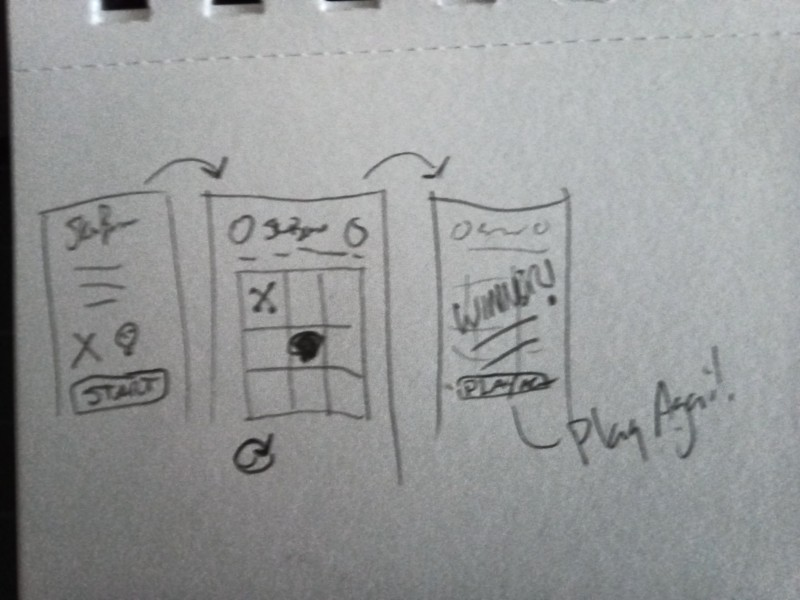

# Skull & Bones Game

A bit cheeky version of tic tak toe with cartoony pirate visual themes.

Made by [Maynard](https://github.com/ManiacalMaynard/) for [The Odin Project](https://www.theodinproject.com/lessons/node-path-javascript-tic-tac-toe). Basic plan is to set this up initially as a single page app and potentially portfolio piece.

### Required Items / User Story

- [ ] Essential thematic design thumbnails
- [ ] Create new artwork for skulls, bones, and other elements
- [x] Mobile first responsive layout - build as-if mobile app

- [ ] Player chooses Skulls or Bones to start the game
- [ ] Play order is set by random (who goes first)

- [x] Build a game board grid with 9 squares, 3x3
- [x] On players turn they can click/touch any open square to fill it with their symbol
- [ ] On computer's turn it chooses any open square randomly (easy mode)
- [ ] After each play (player or computer) the grid is tested for winning state, play continues until winning state is found
- [ ] On winning state, a popup/Modal with "whowon" wins! comes up
- [ ] "Play again" button added to winner modal to clear game board and reset to start screen

### Would be nice

- [ ] Easy or Hard selector which sets computer to random or minmax play choices on start screen
- [ ] Add player name to score keeper
- [ ] Add player two instead of computer player on start screen
- [ ] Add selection of player portraits to player name entry
- [ ] Add random pirate character portrait to represent the computer
- [ ] Score keeper for gaming session (could be local storage)
- [ ] Animate each square-fill with poof or something animated
- [ ] A way to choose multiple themes with different art sets (comic, serious, colorful, etc)

Behold, the original sketch:

